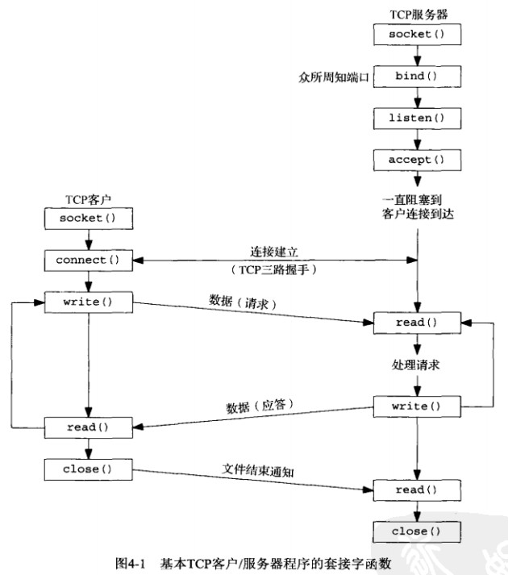
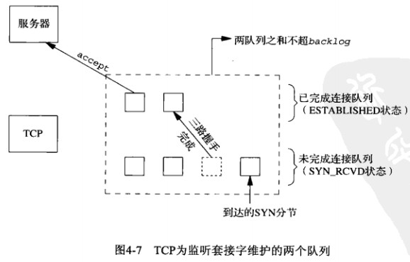
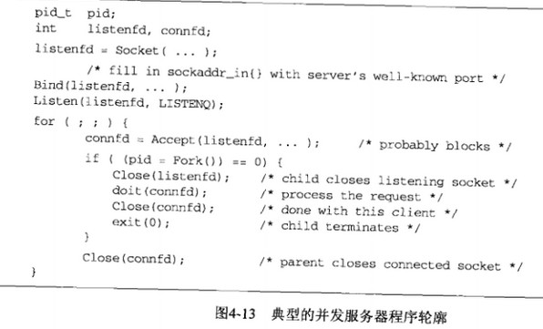
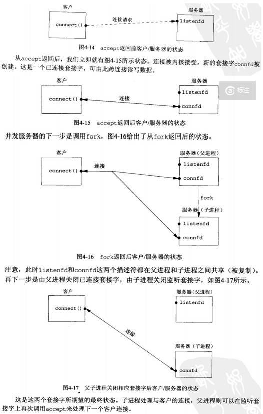

操作系统I/O模型基础
==============

GoLang最大的魅力在于，只要稍微深入一点，你就能看到底层的核心技术。你使用着Go语言，一心想体会它宣称的优点，它会逼着你去了解系统底层的代码，诸如内存分配，网络I/O等知识。边学Go，边复习底层，打通的不仅仅是Go与操作系统的衔接，而是打通了所有语言与操作系统的衔接。

> 【左耳朵耗子】阿里的新同学入职的时候问我，怎么学好技术？我说一定要学好基础，比如:node.js，nginx，以及Java的NIO，虽然这些东西表面上不同，但是如果你把基础知识——操作系统的I/O模型搞懂了，这些东西就一下子就只剩下read the fucking manual了。人与人的学习能力强不强主要是看基础扎不扎实。

于是趁着学习Golang的机会，复习一下操作系统I/O模型。

------

## 基本TCP套接字编程

socket -> TCP -> HTTP

> 套接字编程相关的函数：

>* socket
* connect
* bind
* listen
* accept
* close

### **总体流程**

### **socket 函数**

为了执行网络I/O，一个进程必须做的第一件事情就是调用socket函数，制定期望的通信协议类型（例如使用IPv4的TCP等）

> **`int socket(int family, int type, int protocol);`** 

> **family**：协议族（IPv4、IPv6、Unix域等）
**type**：套接字类型（字节流、数据报、原始、有序分组）
**protocol**：协议类型常值（TCP传输协议、UDP传输协议、STCP传输协议）

> **Return**：若成功则为非负描述符，出错则为-1

socket函数在成功时返回一个小的非负整数值，称为**套接字描述符**，简称**sockfd**。为了得到这个套接字描述符，我们只是制定了协议族和套接字类型，并没有制定本地协议或远程协议地址（指定地址的操作有connect和bind实现）。

### **connect 函数**

TCP客户端用connect函数来简历与TCP服务器的连接

> **`int connect(int sockfd, const struct sockaddr *servaddr, socklen_t addrlen);`**

> **sockfd**：是由socket函数返回的套接字描述符
***servaddr**：是一个纸箱套接字地址结构的指针（套接字地址结构必须含有服务器的IP和端口）
**addrlen**：该结构的大小

> **Return**：若成功则为0，出错则为-1

客户端在调用函数connect前不必非得调用bind函数，bind是人为指定源IP地址和端口，直接调用connect则由内核确定源IP地址，并选择一个临时端口为源端口。

如果是TCP套接字，调用connect函数将激发TCP三次握手过程，而且仅在链接建立成功或出错时才返回。connect函数导致当前套接字从CLOSED状态（该套接字自从有socket函数创建以来一直所处的状态）转移到SYN_SENT状态，若成功则再转移到ESTABLISHED状态。若connect失败则该套接字不再可用，必须关闭，不能对这个套接字再次调用connect函数，都必须close当前的套接字描述符并重新调用socket。

### **bind 函数**

bind函数把一个本地协议地址赋予一个套接字，对于网际网协议，协议地址是32位的IPv4地址或128位的IPv6地址与16位的TCP/UDP端口号的组合。（所以理论上在IPv4上能建立约2^48个连接，32+16=48）

> **`int bind(int sockfd, const struct sockaddr *myaddr, socklen_t addrlen);`**

> **sockfd**：是由socket函数返回的套接字描述符
***myaddr**：一个纸箱特定于协议的地址结构的指针
**addrlen**：该结构的大小

> **Return**：若成功则为0，出错则为-1

如果一个TCP客户端或服务器未曾调用bind捆绑一个端口，当调用connect或listen时，内核就要为响应的套接字选择一个临时端口。让内核来选择临时端口对于TCP客户端来说是正常的，但对于TCP服务器来说却极为罕见，因为服务器是通过他们的众所周知端口被大家认识的（例如http的80端口）。

### **listen 函数**

listen函数仅由TCP服务器调用，它做两件事情：（1）当socket函数创建一个套接字时，它被假设为一个主动套接字，也就是说，他是一个即将调用connect发起连接的客户端套接字。listen函数把一个未连接的套接字转换成一个被动套接字，指示内核应该接受指向该套接字的连接请求。调用listen导致套接字从CLOSED状态转换到LISTEN状态。（2）本函数的第二个参数规定了内核应该为相应套接字排队的最大连接个数。

> **`int listen(int sockfd, int backlog);`**

> **socket**：是由socket函数返回的套接字描述符
**backlog**：未完成连接队列与已完成连接队列长度之和

> **Return**：若成功则为0，出错则为-1

本函数通常应该在调用socket和bind这两个函数之后，并在调用accept函数之前调用。

内核为任何一个给定的监听套接字维护两个队列：
1. 未完成连接队列，已由某个客户端发出并到达服务器，而服务器正在等待完成相应的TCP三次握手过程，这些套接字处于SYN_RCVD状态
2. 已完成连接队列，每个已完成TCP三次握手过程的客户对应其中一项，这些套接字处于ESTABLISHED状态

如果三次握手正常完成，该项就从未完成队列转移到已完成队列的队尾。当进程调用accept时，已完成连接队列中的对头项将返回给进程，或者如果该队列为空，那么进程将被投入睡眠，知道TCP在该队列中放入一项才唤醒它。

当一个客户SYN到达时，若这些队列是满的，TCP就忽略该分解，也就是不发送RST，这样客户端TCP将重新发SYN，期望不久就能在这些队列汇总找到可用空间。

### **accept 函数**

accept函数由TCP服务器调用，用于从已完成连接队列队头返回下一个已完成连接，如果已完成连接队列为空，那么进程被投入睡眠（嘉定套接字为默认的阻塞方式）

> **`int accept(int sockfd, struct sockaddr *cliaddr, socklen_t *addrlen)`**

> ***cliaddr**：已连接的客户端进程的协议地址
***addrlen**：所引用的证书值置为由cliaddr所指的套接字地址结构的长度，该整数值为由内核存放在该套接字地址结构内的确切字节数

> **Return**：若成功则为非负描述符，若出错则为-1

如果accept成功，那么其返回值是由内核自动生成的一个全新描述符，代表与所返回客户的TCP连接，在讨论accept函数时，我们称它的第一个参数为监听套接字（listening socket）描述符（由socket创建，随后用作bind和listen的第一个参数的描述符），称它的返回值为已连接套接字（connected socket）描述符。
区分这两个套接字非常重要，一个服务器通常仅仅创建一个监听套接字，它在该服务器的生命周期内一直存在。内核为每个由服务端进程接受的客户连接创建一个已连接套接字。当服务器完成对某个给定客户的服务时，相应的已连接套接字就被关闭。

### **close 函数**

close函数也用来关闭套接字，并终止TCP连接。

> **`int close(int sockfd);`**

> **Return**：若成功则为0，若出错则为-1

close一个TCP套接字的默认行为是把该套接字标记成为已关闭没然后立即返回到调用进程。

并发服务器中父进程关闭已连接套接字只是导致相应描述符的引用计数值减1，既然引用技术值扔大于0，这个close调用并不引发TCP的死分组连接终止序列，对于父进程与子进程共享已连接套接字的并发服务器来说，这正是所期望的。
如果父进程对每个由accept返回的已连接套接字都不调用close，那么父进程最终将耗尽可用描述符，因为任何进程在任何时刻刻拥有的打开着的描述符数通常是有限制的。

### **fork 和 exec 函数**

fork函数式Unix中派生新进程的唯一方法
> **`pid_t fork(void);`**

> **Return**：在子进程中为0，在父进程中为子进程ID，若出错则为-1

fork调用一次，却返回两次，它在调用进程（父进程）中返回一次，返回值是新派生进程（子进程）的进程ID号；在子进程又返回一次，返回值为0。因此返回值本身告知当前进程是子进程还是父进程。
父进程中调用fork之前打开的所有描述符在fork返回之后由子进程分享。我们看到网络服务器利用这个特性：父进程调用accept之后调用fork，所接收的已连接套接字随后就在父进程与子进程之间共享。通常情况下，子进程接着读写这个已连接套接字，父进程则关闭这个已连接套接字。

fork有两种典型用法：
1. 一个进程创建一个自身的副本，这样每个副本都可以再另一个副本执行其他任务的同时处理各自的某个操作。这是网络服务器的典型用法。
2. 一个进程想要执行另一个程序。既然创建新进程的唯一办法是调用fork，该进程于是首先调用fork创建一个自身的副本，然后其中一个副本（通常为子进程）调用exec把自身替换成新的程序。

### **并发服务器**

当服务一个客户请求可能话费较长时间，我们并不希望整个服务器被单个客户长期占用，而是希望同时服务多个客户。Unix中编写并发服务器程序最简单的办法就是fork一个子进程来服务每个客户。

当一个连接建立时，accept返回，服务器接着调用fork，然后由子进程服务客户（通过已连接套接字connfd），父进程则等待另一个连接（通过监听套接字listenfd）。既然新的客户由子进程提供服务，父进程就关闭已连接套接字。

