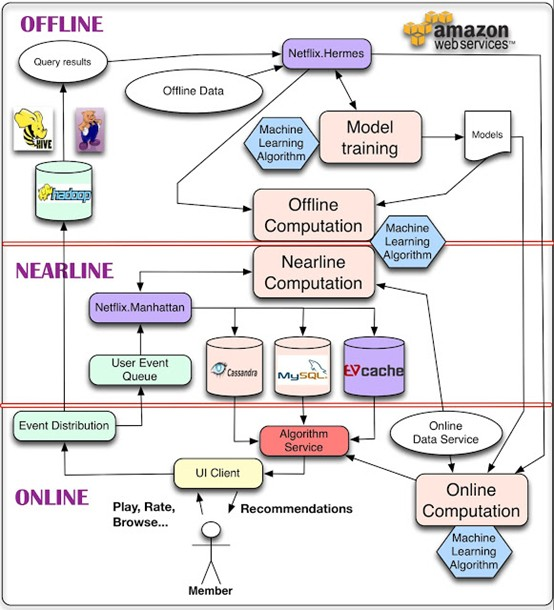
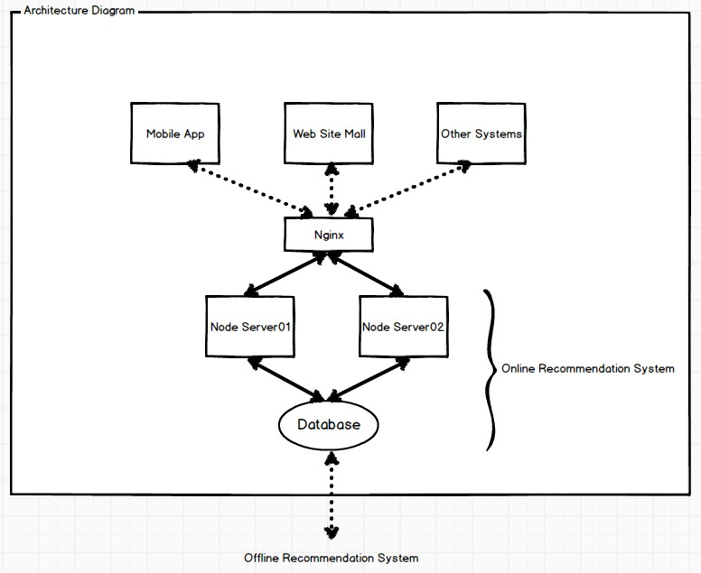

推荐系统对外服务接口解决方案
======

留意**Netfix**的推荐系统的架构，我们可以看到他们公司的推荐系统有明显的分层，分别为离线、近线和在线推荐，各部分职责明确，共同为用户提供推荐服务。将其系统做最大的简化，剩下两部分，离线计算和在线推荐服务，前者通过在内存或Hadoop中计算相似度（或者使用基于模型的方法）为后者提供推荐结果数据，而后者就是直接与外部系统进行对接的Web Service系统，把推荐结果数据返回给外部系统。

> 推荐系统的这一层对外服务接口将是本文阐述的内容。
>
> **关键词：** 推荐系统，WebService，NodeJS，Restify，推荐反馈

## 一. 概述

#### <i class="icon-share"></i> 这一层对外服务接口需要做什么

> **主要职责：**
>
> 1.  接收外部系统的请求，从推荐结果数据中筛选出符合要求的数据，进行返回
> 2.  根据请求，记录ItemID、UserID和其它相关信息log
> 3.  收集推荐反馈数据，如用户点击推荐商品的log

这一层的任务非常简单，没有复杂的业务逻辑，没有耗时的计算任务（当然后期可以在这一层中加上简单的模型计算）。因为这一层是直接对用户负责的。我们都知道，尽管网站前端可以采用延迟加载的技术来请求推荐列表，但长时间得不到响应结果也是不可容忍的，因此这一层做得轻便、能够快速响应成为了最终要的要求。

#### <i class="icon-share"></i> 是否需要将推荐结果响应与推荐反馈分开不同的应用？

它们承载的是不同的任务，一个是将一轮推荐计算的结果呈现给用户，一个是把用户的反馈信息收集起来优化下一轮推荐计算。这么看来把两者分开到不同的系统也是可取的，随着系统日渐庞大，把两个任务独立开来会更便于维护和管理。但是在推荐系统搭建的初期，这两者都只包含很小一部分的功能和代码，那么把它们整合到一起也是可取的，只要代码层次清晰明确，在项目前期也没必要分那么细，系统多了还不方便管理。

## 二. 构建可靠的WebService

#### <i class="icon-share"></i> 技术选型

使用什么语言什么框架都没有所谓，这个年头程序执行的性能瓶颈已经可以通过增加服务器解决了，但也不要选个不靠谱的，服务器还是能省就省，于是选个自己开发起来顺手的语言就好了，这个时代代码开发的速度比执行的速度更重要。

NodeJS在并发处理能力上还算比较出色的，关于它的讨论在这里不展开阐述，这里介绍一个框架，[Resity](https://github.com/mcavage/node-restify)，它能够快速地搭建一个REST风格的API服务，相比于Express等框架，它更显轻量化，仅仅实现了API的功能，没有分层没有模板，响应更加迅速。

#### <i class="icon-share"></i> 系统架构

> **NOTE：**这一层的主要功能就是 1. 从数据库读取信息经过简单地过滤返回给客户端；2. 把客户端请求的log记录到数据库中。

## 三. 可靠的代码更新系统发布机制

进行NodeJS开发的朋友都了解[Forever](https://github.com/nodejitsu/forever)的使用，它是一个监控Node App的运行状态的工具。

> **有以下几个主要作用:**
>
> 1.  快速开启、关闭项目；
> 2.  在代码更新时，便捷地重启项目，但不支持热部署；
> 3.  代码出错导致服务崩溃，能重启应用；
> 4.  系统出错，错误结束NodeJS应用进程时，能自动重启应用；
> 5.  后台运行程序。

这就为集群的发布提供了便利。前面有一台Nginx做引流，将后面的NodeJS服务器更新代码后重启这个步骤变得天衣无缝。

## 四. 问题探讨及后续工作

#### <i class="icon-share"></i> 关于数据库

上文一直提及的数据库，其实并没有明确说明是使用哪个工具，它更加偏向于表示一套数据存储的方案。可以使用MySQL存储离线推荐的计算结果，可以在NodeJS和MySQL之间添加一层Redis缓存以提高查询效率。这一套也只能胜任系统前期的压力，项目发展到后期还会更改数据存储的方案。其实这套存储的方案更多的是根据项目和团队的情况而定的。

#### <i class="icon-share"></i> 关于推荐反馈

推荐系统对外服务层的数据库充当的是在线层与离线层沟通的桥梁，推荐反馈的信息暂存在这一层的数据库当中，还需要有定时任务将推荐反馈的数据抽取到离线的Hadoop集群当中，以便于提高下一轮推荐的效果。当然对于推荐系统的新用户，由于没有购买记录，往往只能根据他最初的几次点击进行推荐，此时推荐的反馈信息又会作用于在线的推荐模型当中，产生实时推荐的结果。

> **参考文章**
>
> [Netfix System Architectures for Personalization and Recommendation](http://techblog.netflix.com/2013/03/system-architectures-for.html)

